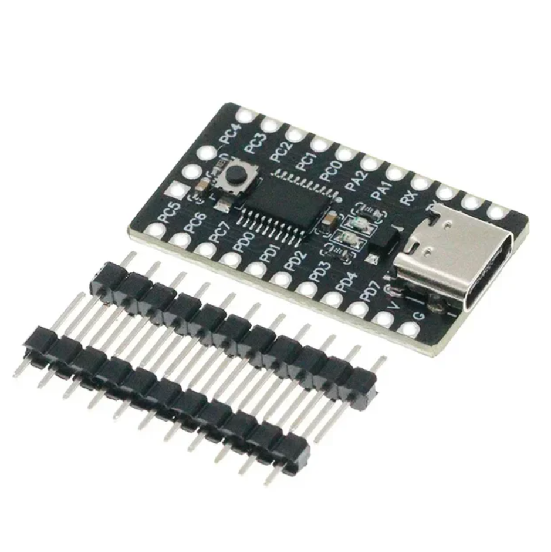

# FINIK CH32V003 SDK

Welcome to the `finik-v003` SDK repository! This SDK provides a seamless and efficient development environment for the CH32V003 microcontroller, combining the simplicity of an Arduino-style project structure with the flexibility of CMake.

## Overview

The CH32V003 microcontroller is a cost-effective solution for various embedded systems projects. This SDK ensures that both novice and experienced developers can quickly get started without requiring extensive setup or deep technical knowledge.


### Key Features

- **Ease of Use**: Simple and intuitive setup process, similar to the Arduino IDE.
- **CMake Integration**: Streamlined project structure managed by CMake, allowing for advanced project configurations.
- **Comprehensive Tooling**: Essential VS Code extensions provided to enhance the development workflow.

## Getting Started (Windows)

To start using the SDK, follow these steps:

1. **Download the toolchain**:
   Download the toolchain from [Yandex Disk](https://disk.yandex.ru/d/RmjCNxb3dcRByQ) or [Google Drive](https://drive.google.com/file/d/1hytLr7pkEfrvUR4fV7C-jODg7oK6aswY/view?usp=sharing), and place it in the project folder.

2. **Install prerequisites**:
   Install the following:
   - [CMake](https://cmake.org/download/)
   - [Git](https://git-scm.com/downloads/win)
   - [Python](https://www.python.org/downloads/windows/)

   Install the Python library (This is needed to send commands to the MCU):
   ```sh
   pip install pyserial
   ```
  
3. **Install VS Code and extensions**:
   Install [VS Code](https://code.visualstudio.com/). Then, in your terminal, run:
   ```sh
   code --install-extension ms-vscode.cpptools \
   --install-extension ms-vscode.cmake-tools \
   --install-extension twxs.cmake \
   --install-extension marus25.cortex-debug \
   --install-extension dan-c-underwood.arm \
   --install-extension zixuanwang.linkerscript \
   --install-extension badlogicgames.serial-plotter \
   --install-extension sanaajani.taskrunnercode \
   --install-extension ms-vscode.cpptools-extension-pack \
   --install-extension eamodio.gitlens \
   --install-extension github.vscode-pull-request-github \
   --install-extension awsxxf.serialterminal
   ```
   Reload VS Code after installation.

4. **Install drivers for USB-UART**:
   You can find common drivers in the toolchain folder.

5. **Clone the repository**:
   Right-click and choose "Open Git Bash Here" in your desired directory, then run:
   ```sh
   git clone https://github.com/karasevia/finik-v003.git
   ```

6. **Set your serial port**:
   Update the `COM18` value in [tasks.json](.vscode/tasks.json) to match your serial port.

7. **Start developing**:
   You are now ready to begin development!

## Development Steps



- Modify the delay time in the loop: [delay](src/main.c#L30)
- Open the Task Runner and run `[flash] update from program`.
- Observe the results on your board.

## Debug with OpenOCD

1. Change the [CMAKE_BUILD_TYPE](cmake/toolchain-ch32v00x.cmake#L47) to `Debug`.
2. Open "Run and Debug" (Ctrl + Shift + D).
3. Start debugging.

## Configurations

The last two memory pages are reserved for saving configuration data during reloading and flashing. This allows you to store up to 62 bytes. To use this, create an object using the following structure:

```c
union config_u {
    config_t raw;
    struct {
        uint8_t mode;
        uint8_t mac[6];
        uint8_t ipv4[4];
        char password[32];
    };
} config;
```

To read and write the settings, use the following methods (data is only written if it has changed):

```c
read_config(&config.raw);
save_config(&config.raw);
```

You can access the configuration like this:

```c
config.mode = 3;
if (config.ipv4[0] == 192 &&
    config.ipv4[1] == 168 &&
    config.ipv4[2] == 0 &&
    config.ipv4[3] == 31) {
    compare(password, config.password);
}
```

## Useful Information


- [Data Sheet](docs/CH32V003DS0.PDF)
- [Reference Manual](docs/CH32V003RM.PDF)

### Acknowledgements

This project is based on and improves upon several existing projects:
- [ch32v307-cmake-vsc-noos-template](https://github.com/sadkotheguest/ch32v307-cmake-vsc-noos-template)
- [arduino-wch32v003](https://github.com/AlexanderMandera/arduino-wch32v003)
